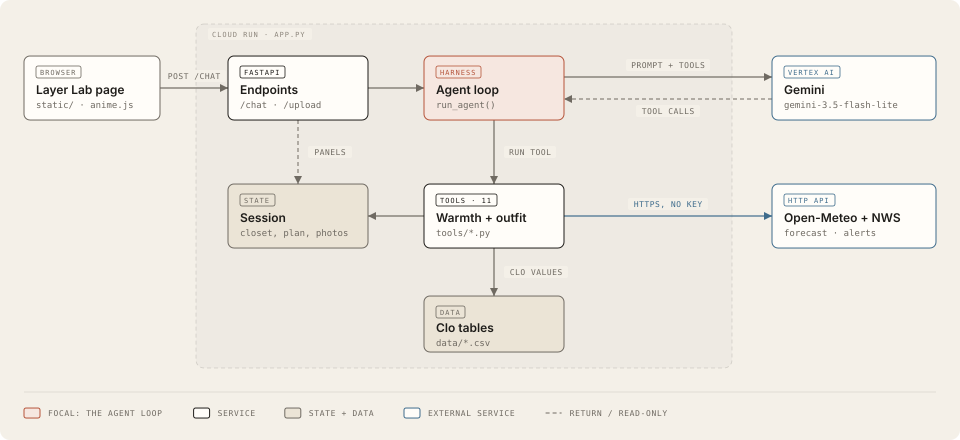

# Layer Lab

**Dress for the hours you're actually outside.**

Layer Lab is a chat agent for students facing a cold NYC winter, especially those from warmer
climates who don't know whether their clothes are warm enough. Describe your day ("walk 20 minutes
to class at 9, sit in class until 1, wait for the bus"), and Layer Lab:

1. pulls the **hourly forecast** for the hours you're outside (Open-Meteo),
2. works out how much **clothing warmth (clo)** you need for each part of the day, indoors and out,
   adjusted for how quickly you feel cold,
3. picks an outfit **from your own closet** that works both outside and in a heated classroom,
   skipping anything in the laundry and warning about rain and wind.

**How to use it:** the intro shows today's real sky through a bedroom window. "Build my closet" takes
you to Step 1: drop in photos of your clothes (and their care labels); each photo is scanned by Gemini
vision, you check the details, and the checklist shows when you have a shirt, bottoms, a coat and shoes
(missing basics are borrowed from a demo closet). Step 2 is the chat: describe your day. Graders can
skip straight to the chat with "or try it with a demo closet".

IEOR 4570 Project 1. Team: Rishika, Shreya, Kshamaa.



## Sample queries

1. `I walk 20 minutes to class at 9am, sit in class until 1, then wait 10 minutes for the bus. What should I wear?`
2. `I always feel cold. Is my grey hoodie enough for a 15 minute walk tonight at 7?`
3. `My jeans are in the wash. I have an interview downtown tomorrow at 10: a 10 minute walk, 30 minutes on the subway, then an hour indoors.`

A demo closet is loaded in every new session, so these work without uploading anything.

## Tools

| Tool | Owner | What it does |
|---|---|---|
| `get_forecast_window` | shared | Hour-by-hour forecast for part of a day (Open-Meteo, external API) |
| `get_weather_alerts` | shared | Active National Weather Service alerts, e.g. Wind Chill Advisory (external API, US only) |
| `plan_day_warmth` | Rishika | Clothing warmth needed per segment of the day, indoor vs outdoor, with a layering plan and any active alerts |
| `set_cold_sensitivity` | Rishika | Remembers whether the user runs cold, average or warm |
| `record_comfort_feedback` | Rishika | Learns from how an outfit felt ("I was freezing"): nudges future plans 0.1 clo warmer or cooler, up to 0.3 |
| `build_outfit` | shared | Ranks outfits from the closet against the plan (warmth, rain, wind, occasion, laundry) |
| `list_wardrobe` / `update_wardrobe` | shared | Shows the closet; marks items worn, clean or in the laundry. A worn item past its wear limit (Shreya, per garment type in `garments.csv`) goes to the laundry automatically |
| `scan_garment` | Shreya | Adds clothes from a photo with Gemini vision, reading the care label for the exact fiber mix; every field is validated against fixed lists. Sample photos: `data/demo_photos/` |
| `style_check` | Kshamaa | Scores whether an outfit goes together: color, shape, pattern, occasion |
| `try_on_outfit` | bonus | Shows the user wearing the outfit (Vertex AI) *(in progress)* |

Every `/chat` response returns `response`, `session_id` and `tool_calls` (name, args, result),
and the page shows each tool call above the answer.

## How warmth is calculated

Warmth is measured in **clo** (a t-shirt is 0.08, a thick sweater 0.36, a down parka about 0.8).

- **Outdoors** we use ISO 11079's duration-limited required clothing insulation (IREQ): the body
  may run down a limited amount of stored heat during a short trip. `clo_min` allows the ISO limit
  of 40 Wh/m²; `clo_ideal` allows half of that. The ISO 9920 correction accounts for wind and
  walking pushing air through clothes.
- **Indoors** we use ASHRAE 55's PMV comfort model: `clo_ideal` is PMV 0 (neutral), `clo_min`
  is PMV -0.5 (edge of the comfort zone). Our PMV code reproduces the ISO 7730 reference values,
  and you can check results with the [CBE Thermal Comfort Tool](https://comfort.cbe.berkeley.edu/).
- **Heating:** NYC law requires heat between 6am and 10pm when it's below 55°F outside, so on those
  days we assume rooms are about 72°F, and about 75°F otherwise.
- **Garment values** come from ASHRAE 55's garment table where available (`data/garments.csv`
  marks which are estimates). **Fiber behavior** in rain and wind (`data/materials.csv`), the
  cold-sensitivity offset (±0.2 clo) and the windproof bonus (10%) are team estimates.

Simplifications: radiant temperature equals air temperature (no sun), wind at body height is two
thirds of the forecast 10 m wind, and trips shorter than 30 minutes count as 30 minutes.
Layer Lab gives clothing suggestions, not medical or safety advice.

## Run locally

1. A GCP project with billing and Vertex AI enabled (see the course's *Setting up GCP and Gemini* guide).
2. `gcloud auth application-default login`
3. `uv run app.py`, then open http://localhost:8000

## Credits

The animated sky ports the WebGL shader from [Originkit](https://www.originkit.dev)'s Cloud Sky component. Several UI effects are plain-JS versions of [React Bits](https://reactbits.dev) components (see DESIGN.md). Motion by [anime.js](https://animejs.com).

## Tests

- `uv run pytest`: offline checks of the warmth model (including the ISO 7730 PMV reference values) and the outfit builder.
- `uv run python evals/tool_calls.py`: 11 real prompts through the agent, checking it calls the right tools in the right order (needs Gemini credentials).

## Security

Photos and anything read from them (care labels, printed text) are treated as data, never as instructions.
Uploads are limited to images under 8 MB, kept in memory for the session only, and never logged or committed.

## Deploy

Cloud Run with continuous deploy from this repo (course guide *Deploying to Cloud Run from GitHub*):
buildpack, entrypoint `uvicorn app:app --host 0.0.0.0 --port $PORT`, IAP restricted to `columbia.edu`.

Settings that matter for this app:
- **Maximum instances: 1.** Sessions (chat, closet, photos) live in the server's memory, so a second
  instance would not know a user's session.
- **Memory: 1 GiB.** Uploaded photos are kept in memory for the session.
- The service account needs the **Vertex AI User** role to call Gemini.
- When the app has been idle long enough for Cloud Run to stop it, sessions reset; reload to start again.

## Project layout

```
app.py              harness (tool-calling loop), sessions, /chat /upload /wardrobe endpoints
session.py          per-session state: messages, closet, cold sensitivity, last plan, photos
tools/              one module per tool area; each exports TOOLS and TOOL_MAP
data/               garment clo values, wear limits, fiber behavior, demo closet, sample scan photos
static/             frontend: index.html, style.css, app.js (anime.js), sky.js (live weather sky)
tests/, evals/      offline unit tests; tool-selection checks against the real model
docs/               architecture diagram
PROPOSAL.md         plan, features and who owns what
DESIGN.md           visual direction and inspiration
```
